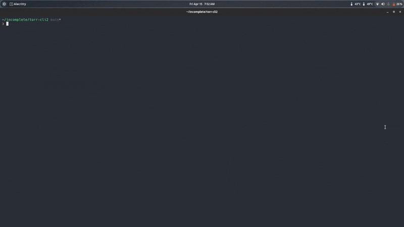

## t-stream 
Stream your favorite torrent in your terminal

### How to use ?
- Install all dependecy and library by running`setup.sh`.
- restart your terminal
- run `t-stream` 
- you can pass torrent name in command line argument in `t-stream`

### Configure
- You can set your player and torrent-client in `config.json` file.
- Only support mpv or vlc and webtorrent or peerflix.
- default player is `mpv` and client in `webtorrent`.

### Dependencies
- [webtorrent-cli](https://github.com/webtorrent/webtorrent-cli)
- [peerflix](https://github.com/mafintosh/peerflix)

### Note
`mpv` is default player for linux based OS .
If you are on windows you have to manually setup and install all requirement files.